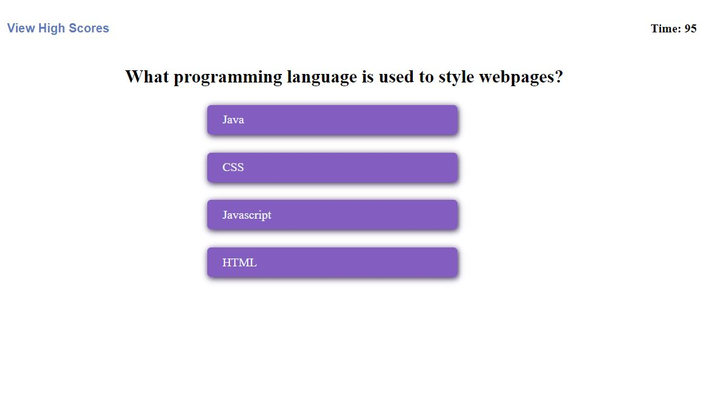

# Code Quiz

## What it does:
The Code Quiz is a "timed" (scored) quiz that will test users' abilities to answer
programming questions similar to a technical interview.

Questions are multiple-choice, and incorrect answers will subtract time from the score.

Once all questions are answered or timer reaches 0, the score will be displayed, along with
any previous high scores.  The quiz will allow users to enter their name if a high score is
achieved.

## Screenshot:

## Deployed Link:

## Author:
Jonathan Williams